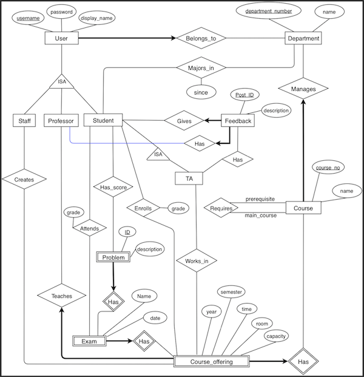

# Fall 2019

  
  <b> CSE-560:  Data Models and Query Languages </b>

### [Project_01](Project_01) :
  

**Problem:** 
Design and Implement a database schema for `TinyHub`, which is a course enrollment website. It provides simple functions, main functions of TinyHub are the following:  

● `User management`: user sign up, user login/logout  

Users can be of three types: Students, Professors, and Staff. Users sign up using their email addresses, the email addresses are used as the TinyHub usernames of the users, users need to set their passwords and display names, where:
 - username, password and display names are strings.
 - one account, i.e. one username, has only one display name, and one display name
corresponds to only one username.
 - one email address can be used to register only one account.
 - each user belongs to a department. Department has an identifying department number. Student can have multiple majors, i.e. a student in Computer Science and Math.  
 
● `Department-course relationship management`: create and delete a course  

Course has a unique course number. The information of a course is provided each semester by the Staff in the appropriate department and consists of:
  - Name of the course.
  - Department of the course.
  - The instructor, an instructor has to be a professor. Different professors may teach the same course in different semesters.
  - The TAs of this course. All TAs must be students. A course can have many TAs and
different TAs in different semesters.
  - The prerequisite courses of the course. A course may have zero or more prerequisite
courses.  

● `Enrollment`: Register/Enroll for a course, provide feedback  

- A student can enroll in a course only if
  - that student passes all the prerequisite courses
  - it is being offered by a department they are majoring in
  - the capacity of the course is not full  
- Students will have a grade (F/D/C/B/A) with the course, which will be given after the student
finishes the course.
- Students can post feedback for the instructor or TAs of the course in which they enrolled.
- Each course has one or more exams. Students who take that course have letter grades on
those exams.
- Each exam has a number of problems. Students have scores on those problems.  

The DB schema must be able to support all the functions listed above. Use E/R modeling and E/R diagram to design the database, map the E/R model to a relational database schema, and implement the mapped schema using a RDBMS by a set of CREATE TABLE statements.

&nbsp;&nbsp;&nbsp;&nbsp;&nbsp;&nbsp;&nbsp;&nbsp;&nbsp;&nbsp;&nbsp;&nbsp;&nbsp;&nbsp;&nbsp;&nbsp;&nbsp;&nbsp;&nbsp;&nbsp;&nbsp;&nbsp;&nbsp;&nbsp;&nbsp;&nbsp;&nbsp;&nbsp;&nbsp;&nbsp;&nbsp;&nbsp;&nbsp;&nbsp;&nbsp;&nbsp;&nbsp;&nbsp;&nbsp;&nbsp;&nbsp;&nbsp;&nbsp;&nbsp;&nbsp;&nbsp;&nbsp;&nbsp;&nbsp;&nbsp;&nbsp;&nbsp;&nbsp;&nbsp;&nbsp;&nbsp;&nbsp;&nbsp;&nbsp;&nbsp;&nbsp;&nbsp;&nbsp;&nbsp;&nbsp;&nbsp;&nbsp;&nbsp;&nbsp;&nbsp;&nbsp;&nbsp;&nbsp;&nbsp;&nbsp;&nbsp;&nbsp;&nbsp;&nbsp;&nbsp;&nbsp;&nbsp; [DDL_Script](Project_01/My_Submission/TinyHUB.sql)  &nbsp;&nbsp;&nbsp;&nbsp;&nbsp;&nbsp; [Report](Project_01/My_Submission/report.pdf)

  <b> E/R diagram </b>  
      

### [Project_02](Project_02) :
  

**Problem:** 
The project is about writing queries in SQL2 and SQL3, relational algebra formulation, representing Graph in SQL and recursive query problems. This project contains some advanced SQL problems which are really challenging to solve.

&nbsp;&nbsp;&nbsp;&nbsp;&nbsp;&nbsp;&nbsp;&nbsp;&nbsp;&nbsp;&nbsp;&nbsp;&nbsp;&nbsp;&nbsp;&nbsp;&nbsp;&nbsp;&nbsp;&nbsp;&nbsp;&nbsp;&nbsp;&nbsp;&nbsp;&nbsp;&nbsp;&nbsp;&nbsp;&nbsp;&nbsp;&nbsp;&nbsp;&nbsp;&nbsp;&nbsp;&nbsp;&nbsp;&nbsp;&nbsp;&nbsp;&nbsp;&nbsp;&nbsp;&nbsp;&nbsp;&nbsp;&nbsp;&nbsp;&nbsp;&nbsp;&nbsp;&nbsp;&nbsp;&nbsp;&nbsp;&nbsp;&nbsp;&nbsp;&nbsp;&nbsp;&nbsp;&nbsp;&nbsp;&nbsp;&nbsp;&nbsp;&nbsp;&nbsp;&nbsp;&nbsp;&nbsp;&nbsp;&nbsp;&nbsp;&nbsp;&nbsp;&nbsp;&nbsp;&nbsp;&nbsp;&nbsp;&nbsp;&nbsp;&nbsp; [SQL_Script](Project_02/My_Submission/code.sql)

### [Project_03](Project_03) :
  

**Problem:** 
The project is based on `XML & XQuery` and `DTD conversion`. Finding necessary information from XML documents using XML and XQuery.

&nbsp;&nbsp;&nbsp;&nbsp;&nbsp;&nbsp;&nbsp;&nbsp;&nbsp;&nbsp;&nbsp;&nbsp;&nbsp;&nbsp;&nbsp;&nbsp;&nbsp;&nbsp;&nbsp;&nbsp;&nbsp;&nbsp;&nbsp;&nbsp;&nbsp;&nbsp;&nbsp;&nbsp;&nbsp;&nbsp;&nbsp;&nbsp;&nbsp;&nbsp;&nbsp;&nbsp;&nbsp;&nbsp;&nbsp;&nbsp;&nbsp;&nbsp;&nbsp;&nbsp;&nbsp;&nbsp;&nbsp;&nbsp;&nbsp;&nbsp;&nbsp;&nbsp;&nbsp;&nbsp;&nbsp;&nbsp;&nbsp;&nbsp;&nbsp;&nbsp;&nbsp;&nbsp;&nbsp;&nbsp;&nbsp;&nbsp;&nbsp;&nbsp;&nbsp;&nbsp;&nbsp;&nbsp;&nbsp;&nbsp;&nbsp;&nbsp;&nbsp;&nbsp;&nbsp;&nbsp;&nbsp;&nbsp;&nbsp;&nbsp;&nbsp; [XQuery_script](Project_03/My_Submission/xml_xquery.txt)
